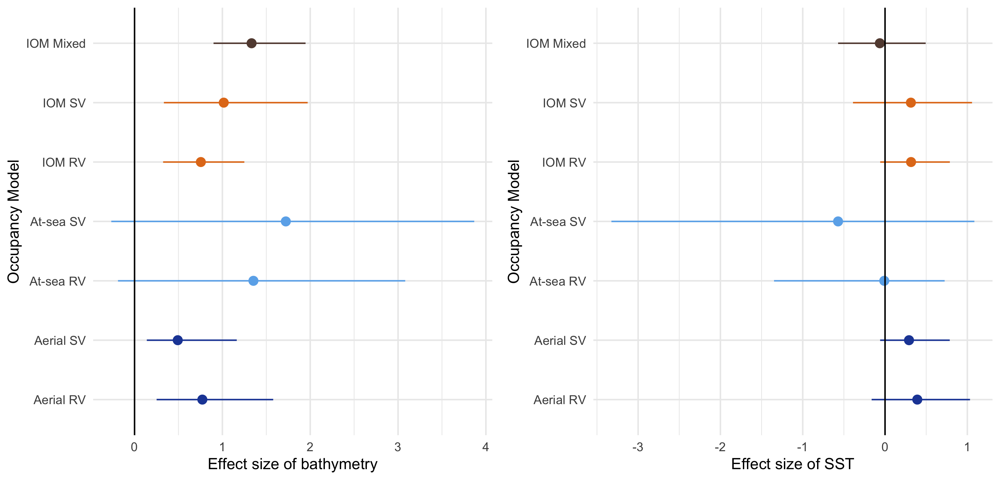
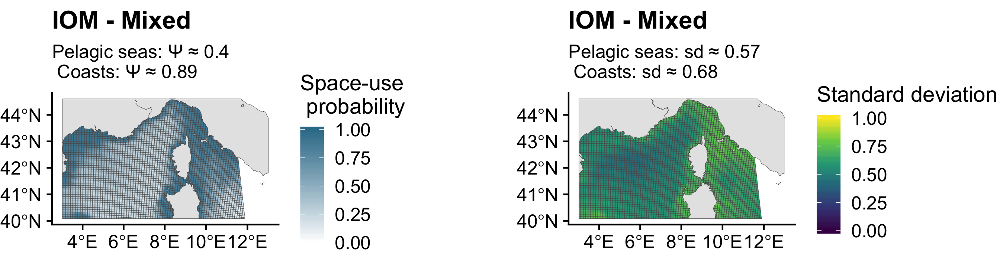

<style>
p.caption {
  font-style: italic;
}
p style='text-align: justify;'
</style>


Supporting information 3 of article _Using single visits into integrated occupancy models to make the most of existing monitoring programs_.  

Miller et al. (2019) encouraged further developments of methods mixing standardized and non-standardized datasets. In this spirit, we built an integrated occupancy model mixing repeated-visit occupancy models for aerial surveys and single-visit occupancy models for at-sea surveys.

In this document, we present how we built this "mixed" integrated occupancy model analysing the aerial surveys with repeated-visit, and the at-sea surveys with single-visit occupancy models.

# Methods

Required packages

```{r warning=FALSE, message=FALSE, cache=TRUE}
library(R2jags)
library(tidyverse)
library(cowplot)
```

### State process

The occupancy state $z$ was drawn from a Bernoulli distribution with parameter $\psi$, $z \sim \mbox{Bernoulli}(\psi)$. We wrote $\psi$ as a logistic function of two environmental covariates $\mbox{bathy}$ (bathymetry), and $\mbox{SST}$ (Sea Surface Temperature):

$$\mbox{logit}(\psi) = \alpha_{0} + \alpha_{1} \; \mbox{bathy} + + \alpha_{2} \; \mbox{SST}$$ 

where $\alpha_{0}$, $\alpha_{1}$, and $\alpha_{2}$ are unknown parameters that need to be estimated.  

### Observation process

The observations are drawn either from a Bernoulli distribution with parameter $p$ or a multinomial distribution depending on two detection probabilities $p1$ and $p_2$ for the integrated occupancy model in the manuscript. We wrote $p$ as a logistic function of a sampling effort covariate $\mbox{seff}$:

$$\mbox{logit}(p) = \beta_{0} + \beta_{1} \; \mbox{seff}$$ 

where $\beta_{0}$ and $\beta_{1}$ are unknown parameters that need to be estimated.  

### Mixed modelling

In the mixed integrated occupancy model, the state process remains enchanged. However, there are 2 different detection processes.  

We separated the repeated-visits aerial detections $ya$ (with 4 columns as 4 sampling occasions), from the single-visit at-sea detections $ya$ (i.e. 1 column).

Both $ya$ and $ys$ are binary datasets (O/1). Then, there are 2 draws in Bernoulli distributions, with their associated $pa$, and $ps$.

  * $ya_{i,j} \sim  \mbox{Bernoulli}(z_{i}\; pa_{i,j})$  
  * $ys_{i} \sim \mbox{Bernoulli}(z_{i} \; ps_{i})$   
  

Hereafter, you would find the JAGS formulation of this occupancy model. 
 
```{r eval = FALSE, cache=TRUE}
# Specify model in BUGS language
sink("mixed_std_sv.jags")
cat("
    model {
    
   # priors

    alpha.psi ~ dnorm(0,0.444) # occupancy intercept
    alpha.pa ~ dnorm(0,0.444) # detection aerial intercept 
    alpha.ps ~ dnorm(0,0.444) # detection at-sea intercept 
    
    beta.sst ~ dnorm(0,0.444) # slope sst effect
    beta.bathy ~ dnorm(0,0.444)	# slope bathy effect
    beta.eff.a ~ dnorm(0,0.444)	# slope aerial survey effort effect
    beta.eff.s ~ dnorm(0,0.444)	# slope at-sea survey effort effect
    beta.occ2 ~ dnorm(0,0.444) # occasion effect
    beta.occ3 ~ dnorm(0,0.444) # occasion effect
    beta.occ4 ~ dnorm(0,0.444) # occasion effect	
    
    # State process 
    
   for (i in 1:nsite){
      z[i] ~ dbern(psi[i])
  
     logit(psi[i]) <- lpsi[i]
    
     lpsi[i] <- alpha.psi + beta.sst * SST[i] + beta.bathy * BATHY[i]
 
  }  # i  
    
     # Detection process
  
    # At-sea monitoring
    for(i in 1:nsite){

     mu.p_s[i] <- z[i] * p_s[i]

    logit(p_s[i]) <- alpha.ps + beta.eff.s*eff.s[i]

   y_s[i] ~ dbern(mu.p_s[i])

    } #i 
    
    # Aerial monitoring
    for(i in 1:nsite){
      for (j in 1:nrep){

            mu.p_a[i,j] <- z[i] * p_a[i,j] 

            logit(p_a[i,j]) <- lp_a[i,j] 

            lp_a[i,j] <- alpha.p_a + beta.eff.a * eff.a[i,j] + beta.occ2 * equals(j,2) + beta.occ3 * equals(j,3) + beta.occ4 * equals(j,4) 
    
            y_a[i,j] ~ dbern(mu.p_a[i,j])
    
    } #j
    
  } #i
    
    }#fin du modele
    ", fill = TRUE)

sink()
```

# Results

Hereafter, we show the effect size the environmental covariates on the estimated occupancy probability ($\psi$).

<center>
```{r echo=FALSE, fig.fullwidth=TRUE, fig.cap="Fig.1 :Effect size of sea surface temperature (SST) and bathymetry on the space-use probability. Posterior mean is given with the associated 95% credible interval. Estimates are given on the logit scale.", cache=TRUE}

```
</center>

“SV” refers to single-visit occupancy models. "RV” refers to repeated-visit occupancy models. “IOM” stands for integrated occupancy models, in which aerial surveys and at-sea surveys are combined. "IOM - Mixed" refers to the model described above in this document 

<center>
```{r echo=FALSE, cache=TRUE, fig.cap = "Fig. 2: Map of predicted space use for Hybrid model", fig.height=  15}

```
</center>

The Mixed IOM model displayed similar estimates of effect size to estimates obtain from other occupancy models presented in the manuscript. We considered that the Mixed - IOM model had a better performance than the IOM SV model. The precision of the covariate effect size on $\psi$ was greater than "IOM SV" on (Fig. 1), but equivalent than "IOM RV".

# Discussion  

This hybrid model highlights the flexibility of occupancy model to fit with the sampling designs of existing datasets. However, the separated formulation of the detection process into 2 Bernoulli draws is relevant only if the monitoring programs are independant. Dependance between monitoring devies requires to model explicitly the covariation between detection probabilities (Clare et al. 2017)


# References 

Clare J, McKinney ST, DePue JE, Loftin CS. 2017. Pairing field methods to improve inference in wildlife surveys while accommodating detection covariance. Ecological Applications 27:2031–2047.

Miller, D. A. W., Pacifici, K., Sanderlin, J. S., & Reich, B. J. (2019). The recent past and promising future for data integration methods to estimate species’ distributions. Methods in Ecology and Evolution, 10(1), 22–37. https://doi.org/10.1111/2041-210X.13110

